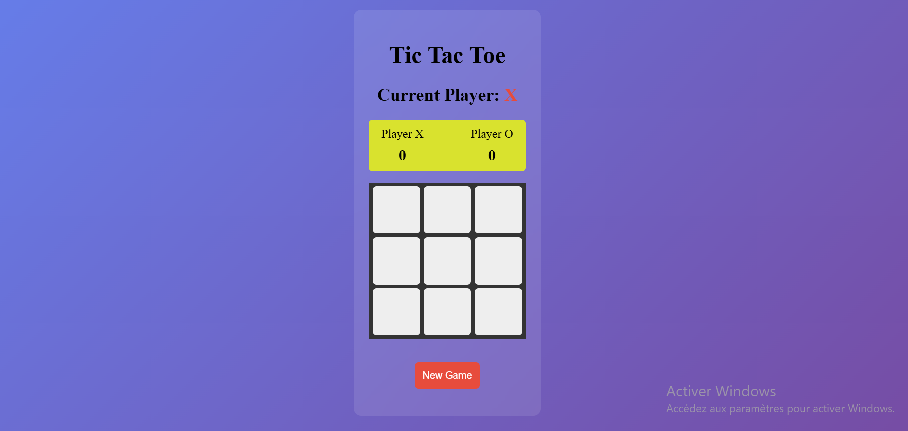

# Tic-tac-toe
Making a Tic Tac Toe game you can play in your browser!

## About The project

Make a Tic-tac-toe game using Javascript as part of [The odin Project](theodinproject.com) Curriculum.

## Features

- Grid of 3x3 as the board.
- Tracking score of the Players.
- Displays a message at the end of each roung indicating the winner or if it's a draw.
- Button "New Game" allows to restart a new game during or the end of each round.

## 📸 Preview

## 💡 Possible Improvements:
- End the game after a certain number of rounds (like 10 for example).